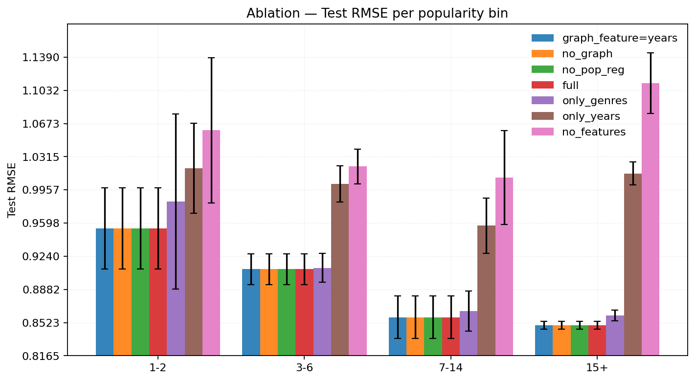

# Collaborative filtering for Recommendation Systems using Matrix Factorization

Imagine building a **recommendation system that predicts what movies you might like based on your past ratings and those of similar users**. Intuitively, this involves filling in a large matrix where rows represent users, columns represent movies, and the entries are ratings. However, most of this matrix is empty because users only rate a small fraction of movies. So how do we predict those missing ratings knowing that we have very little data for many users and items?

This is a classic problem in data science known as **collaborative filtering**. It looks for patterns in user behavior and item characteristics to infer preferences, even when direct ratings are sparse. This repository contains a project that implements this kind of model using **matrix factorization techniques**, to predict user-item ratings in a sparse matrix.

---
## 1. Problem Statement

We aim to predict unobserved user–item ratings in a sparse matrix $R \in \mathbb{R}^{m \times n}$, where each entry $R_{ui}$ is the rating given by user $u$ to item $i$.
Only a small subset of entries ($\Omega \subset [m] \times [n]$) is observed, making the task one of **matrix completion under sparsity**.

The model must generalize to unseen $(u, i)$ pairs, even when either the user or item has few interactions (the cold-start problem).

We measure predictive quality via the Root Mean Squared Error (RMSE):

$$
\mathrm{RMSE} =
\sqrt{
\frac{1}{|\Omega_{\mathrm{test}}|}
\sum_{(u,i) \in \Omega_{\mathrm{test}}}
(R_{ui} - \widehat{R}_{ui})^2
}.
$$

---

## 2. Our solution

Our final model represents the predicted rating $\widehat{R}_{ui}$ with several low-rank matrices $U, V, W_f$ learned from data, where $U$ and $V$ capture latent user and item factors, and $W_f$ project item features into the latent space. We further extend this approach by adding bias terms.

$$
\boxed{
\widehat{R}_{ui} =
U_u^\top \left(
V_i \times \sum_{f \in \mathcal{F}}
  W_f^\top x_{i,f}
  \right) + \mu + b_u + b_i
}
$$

where:

- $U \in \mathbb{R}^{m \times k}$: user latent factors
- $V \in \mathbb{R}^{n \times k}$: item latent factors
- $x_{i,f}$: feature vector for item (i) in feature group (f) (e.g. genre, year)
- $W_f \in \mathbb{R}^{d_f \times k}$: projection from feature space to latent space
- $\mu$: global mean;
- $b_u, b_i$: user and item biases
- $k$: latent dimension

The loss minimized over observed ratings is enriched with several regularization terms to incorporate side information. Some of these regularizations are optional and can be deactivated, but the most complete formula of the loss function is:

$$
\begin{aligned}
\mathcal{L} &=
\sum_{(u,i)\in \Omega}
\bigl(R_{ui} - U_u^\top (V_i + \sum_f W_f^\top x_{i,f}) - \mu - b_u - b_i \bigr)^2 -
\end{aligned}
$$
$$
\begin{aligned}
\textcolor{teal}{
-\lambda_u |U|_F^2 - \sum_i \lambda_{v,i} |V_i|_2^2} \textcolor{olive}{- \sum_f \lambda_{w_f} |W_f|_F^2} \textcolor{brown}{- \lambda_{b_u}|b_u|_2^2 - \lambda_{b_i}|b_i|_2^2 - 
}
\end{aligned}
$$
$$
\begin{aligned}
\textcolor{purple}{
-\alpha\mathrm{Tr}(V^\top L V)
},
\end{aligned}
$$

where:

- $\textcolor{teal}{\text{User/item shrinkage } (\lambda_u, \lambda_{v,i})}$
  Standard $L_2$ control, but item regularization optionally adapts to popularity of the item $i$:
$$
  \lambda_{v,i} = \frac{\lambda_v}{\sqrt{c_i + 1}},
  \quad
  c_i = |{u : (u,i)\in\Omega}|.
$$
- $\textcolor{olive}{\text{Feature projections } (\lambda_{w_f})}$
  Penalize large deviations of learned feature embeddings.
- $\textcolor{brown}{\text{Bias regularization } (\lambda_{b_u}, \lambda_{b_i})}$
  Control overfitting of user/item biases.
- $\textcolor{purple}{\text{Item similarity } (\alpha \mathrm{Tr}(V^\top L V))}$
  Enforces smoothness between similar items using a Laplacian graph ($L = D - S$):
$$
  \mathrm{Tr}(V^\top L V) = \frac{1}{2} \sum_{i,j} S_{ij}|V_i - V_j|^2,
$$
  where $S$ encodes cosine similarity between items derived from features (e.g. genres).

Even though the overall objective is non-convex, it is convex with respect to each matrix when fixing the others, and this has a closed-form solution. Therefore, we use an Alternating Least Squares (ALS) approach to optimize the parameters iteratively.

The updates are repeated for a fixed number of iterations, but the early stopping is implemented to reduce training time and prevent overfitting.

At each iteration, we update each parameter in turn by solving the following subproblems (with Cholesky decomposition for efficiency):

$$
U_u \leftarrow
\arg\min_x
|r_u - Z_u x|_2^2 + \lambda_u |x|_2^2,
$$
$$
V_i \leftarrow
\arg\min_x
|r_i - U_i x|_2^2 + \lambda_{v,i}|x|_2^2 + \alpha \psi_i(x),
$$
$$
W_f \leftarrow
\arg\min_x
\sum_{(u,i)\in\Omega}
(R_{ui} - U_u^\top (V_i + \sum_{f' \ne f} W_{f'}^\top x_{i,f'}) - \mu - b_u - b_i - U_u^\top x_{i,f} x) ^2 + \lambda_{w_f} |x|_F^2,
$$
$$
b_u \leftarrow
\frac{\sum_{i: (u,i)\in\Omega}
(R_{ui} - U_u^\top (V_i + \sum_f W_f^\top x_{i,f}) - \mu - b_i)}
{|\{i: (u,i)\in\Omega\}| + \lambda_{b_u}},
$$
$$
b_i \leftarrow
\frac{\sum_{u: (u,i)\in\Omega}
(R_{ui} - U_u^\top (V_i + \sum_f W_f^\top x_{i,f}) - \mu - b_u)}
{|\{u: (u,i)\in\Omega\}| + \lambda_{b_i}},
$$
$$
\mu \leftarrow
\frac{1}{|\Omega|}
\sum_{(u,i)\in\Omega}
(R_{ui} - U_u^\top (V_i + \sum_f W_f^\top x_{i,f}) - b_u - b_i).
$$

This alternating scheme converges quickly (typically <10 iterations with early stopping).

---

## 3. Hyperparameter Tuning

From our solution above, we can see that there are several hyperparameters to tune. So, once the model was implemented, we performed a hyperparameter search using Optuna with 3-fold cross-validation on the frozen folds that we created from the dataset. Each trial minimizes the mean validation RMSE across folds. We used a TPE sampler and MedianPruner, with early stopping enabled inside ALS (`es_tol = 1e−4`, `es_min_iters = 10`). The optimization ran for 150 trials.

The following hyperparameters were tuned:

| Hyperparameter           | Description                                    | Search Space               |
| ------------------------ | ---------------------------------------------- | -------------------------- |
| `n_factors`              | Latent dimensionality ($k$)                         | [1, 150]                   |
| `lambda_u`, `lambda_v`   | User/item $L_2$ regularization                    | [1e−4, 1e4] (log)          |
| `lambda_bu`, `lambda_bi` | Bias regularization                            | [1e−4, 1e4] (log)          |
| `lambda_w_<f>`           | Feature regularization (for `genres`, `years`) | [1e−4, 1e4] (log)          |
| `alpha`                  | Graph regularization strength                  | [0, 100]                   |
| `S_topk`                 | Graph similarity top-K                         | [1, 610]                   |
| `S_eps`                  | Graph epsilon cutoff                           | [1e−10, 1e−4]              |
| `pop_reg_mode`           | Item popularity weighting                      | {`None`, `inverse_sqrt`}   |
| `update_w_every`         | Frequency of W updates                         | [1, 60]                    |
| `n_iters`                | Max iterations                                 | 100 (fixed because of early-stopping) |

**Best validation RMSE:** 0.8663
**Mean training iterations:** 13 (all early-stopped folds)
**Features used:** `genres`, `years`
**Graph source:** `genres` (cosine similarity)
**Regularization mode:** inverse-sqrt popularity scaling

> The best model combined feature-based item embeddings, graph regularization, and popularity-aware item shrinkage, suggesting that integrating side information improves generalization.

---

## 4. Ablation Study

Since the best model combined all available components, to better understand the contribution of each of them to the overall performance, we performed an ablation study by disabling or altering one component at a time and measuring the impact on performance. The variants tested are summarized in the table below:

| Variant                         | Description                                             | Disabled / Altered Components   |
| ------------------------------- | ------------------------------------------------------- | ------------------------------- |
| **full**               | All components enabled (baseline) | –                             |
| **no_features**        | Remove all side features          | $λ_{W_f}=0$             |
| **only_genres**        | Keep only genre features          | $λ_{W_{years}}=0$         |
| **only_years**         | Keep only year features           | $λ_{W_{genres}}=0$       |
| **no_graph**           | Disable Laplacian regularization  | $α=0$                           |
| **graph_feature=year** | Graph built from year similarity  | replace source feature for similarity computation        |
| **no_pop_reg**         | Uniform item regularization       | pop_reg_mode=None            |

All variants were evaluated on the same folds. The main metric is Test RMSE, complemented with per-popularity-bin RMSE to assess cold-item performance. We also report paired sign-test p-values against the baseline as well as FDR-corrected p-values to account for multiple comparisons.

| Variant               | Time |Train RMSE| Test RMSE | Cold Bin RMSE | Popular Bin RMSE | Raw p-value | FDR Corrected p-value |
| --------------------- | ---- | -|-------- | -------------- | ----------------- | ------- | --------------------- |
| **full**|37.2270 $\pm$ 5.1053 |0.7900 $\pm$ 0.0017| **0.8618 $\pm$ 0.0069**|**0.9541 $\pm$ 0.0441**|**0.8495 $\pm$ 0.0043**| | |
| **no_features**|52.3489 $\pm$ 2.4499 |**0.7083 $\pm$ 0.0017**|1.0834 $\pm$ 0.0193|1.0602 $\pm$ 0.0784|1.1109 $\pm$ 0.0327| 0.0625| 0.1250|
| **only_genres**|36.1364 $\pm$ 2.2956 |0.7869 $\pm$ 0.0017|0.8714 $\pm$ 0.0059|0.9831 $\pm$ 0.0946|0.8602 $\pm$ 0.0057| 0.0625| 0.1250|
| **only_years**|59.9810 $\pm$ 3.4902 |0.7117 $\pm$ 0.0017|1.0034 $\pm$ 0.0087|1.0191 $\pm$ 0.0484|1.0135 $\pm$ 0.0125|0.0625| 0.1250|
| **no_graph**|**26.4977 $\pm$ 1.9122** |0.7900 $\pm$ 0.0017|**0.8618 $\pm$ 0.0069**|0.9541 $\pm$ 0.0441|**0.8495 $\pm$ 0.0043**| 1.000|1.000|
| **graph_feature=year**|42.0569 $\pm$ 1.1031 |0.7900 $\pm$ 0.0017|**0.8618 $\pm$ 0.0069**|0.9541 $\pm$ 0.0441|**0.8495 $\pm$ 0.0043**| 1.000|1.000|
| **no_pop_reg**|47.1860 $\pm$ 16.5324|0.7900 $\pm$ 0.0017|**0.8618 $\pm$ 0.0069**|0.9541 $\pm$ 0.0441|**0.8495 $\pm$ 0.0043**| 1.000|1.000|

## 5. Results and Discussion

The most visible effect appears when side features are removed: without genres and years, the test RMSE increases by about +0.22, which suggests that these metadata capture structure that the latent factors alone fail to model. Using only one feature type also weakens performance:  `only_genres` remains relatively close, while `only_years` degrades more noticeably, indicating that both sources provide complementary information. Disabling the graph term or switching its similarity source produces almost no change in RMSE, but consistently shortens training, because the construction of the similarity graph takes time. The popularity-aware shrinkage behaves as expected, stabilizing the cold bin without degrading performance on popular items.
However, none of these effects pass the significance threshold ($\alpha = 0.05$ after FDR correction), so they should be interpreted as simple tendencies rather than definitive conclusions. Increasing the number of folds or seeds or implementing nested cross-validation would likely improve statistical power and make these patterns clearer.

  
  
  

  <em>Fig. 1: (a) Test RMSE by variant; (b) Training time by variant; (c) Test RMSE per item-popularity bin (mean ± std across folds).</em>

---

## 6. Conclusion

This project implemented a recommender system based on matrix factorization, extended with graph regularization, side-feature projections, and popularity-dependent item shrinkage. The results suggest that feature-based item embeddings contribute most to predictive quality, while graph and popularity terms primarily help with stability and calibration.

Although the method itself is simple, particular care was taken to implement a reliable workflow for model selection, hyperparameter tuning, and ablation analysis. The code was structured with reusability in mind: it should be straightforward to add new features, modify the similarity graph, or test temporal extensions. The project can therefore serve as a solid baseline that can be reused and expanded to serve for more complex models in future work.

## References
[1] M. Belkin and P. Niyogi, “Laplacian eigenmaps and spectral techniques for embedding and clustering,” in Advances in Neural Information Processing Systems (NeurIPS), MIT Press, 2001, pp. 585–591.

[2] Y. Li, J. Lee, and Y. Lee, “Matrix factorization with graph regularization for collaborative filtering,” Proceedings of the 24th ACM international conference on information and knowledge management, pp. 79–88, 2015.
